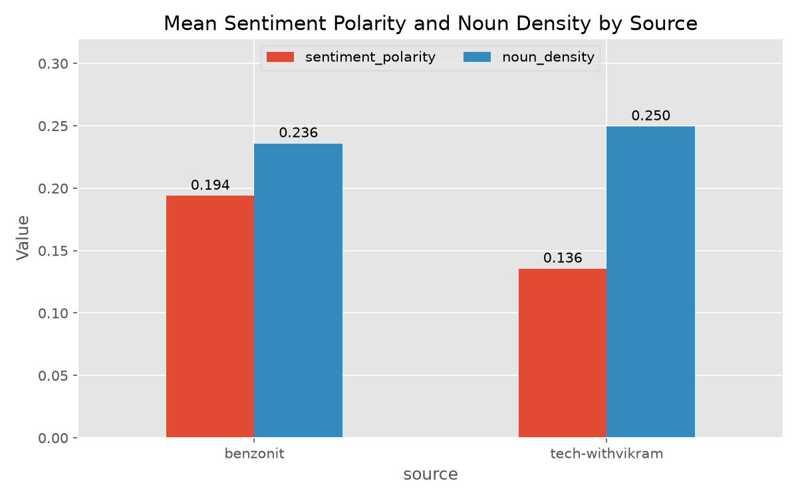

# Lab 02 Report — Web Scraping, Feature Engineering and EDA

**Course:** Introduction to Artificial Intelligence
**Environment:** Python (conda env `ai-lab`), spaCy `en_core_web_sm`, TextBlob, scikit-learn

---

## 1. NumPy vs native Python loop (Task 2.1)

| Method | Sum of 10,000,000 random values | Time |
|---|---|---|
| `np.sum(data)` (vectorised) | 4999379.38 | **0.02744 s** |
| Python `for` loop | 4999379.38 | **5.98242 s** |

NumPy was about **218× faster** on this machine. Both methods give the same sum, so the speed-up is not bought with lost accuracy. The loop pays interpreter overhead on every one of the ten million iterations. `np.sum` runs one compiled routine over a contiguous block of memory. The practical rule for the rest of the course is to express work as operations on whole arrays and keep loops out of interpreted Python.

## 2. Data acquisition (Task 2.2)

Articles were scraped with `requests` (browser-like `User-Agent`, 10 s timeout, 1 s pause between requests) and parsed with BeautifulSoup/lxml. The raw scrape was saved to `articles_raw.csv` so the later steps work offline.

The lab corpus has **4 articles**, not 5. One page (`cj-affiliate-ultimate-guide-to.html`) was skipped by the quality filter because no text was found inside its `
` tags (see Exercise 1).

## 3. Feature engineering (Task 2.3)

For each article the notebook computes `num_tokens`, `num_sentences`, `num_entities`, `num_nouns` and `title_length`, plus TextBlob polarity and subjectivity.

| Feature | Range across the 4 articles |
|---|---|
| Tokens | 1,188 – 1,723 |
| Sentences | 47 – 65 |
| Named entities | 24 – 103 |
| Sentiment polarity | 0.197 – 0.229 |
| Sentiment subjectivity | 0.436 – 0.584 |

**Reading the entities.** The first 15 entities of article 1 show that the entity count is noisy. spaCy labels "AI" as `GPE` (a country/city) and as `ORG`, tags the bare number "10" as `CARDINAL`, and labels "Magic Studio" (a product) as `PERSON`. `num_entities` therefore partly counts model mistakes, and it should be treated as a rough indicator of how many proper names an article contains, not as an exact count of real-world entities.

**Sentiment.** All four articles are mildly positive (about 0.2) and moderately subjective (about 0.44–0.58). That is the typical profile of promotional blog writing: they express opinion that the tools are good rather than presenting evidence.

## 4. Exploratory data analysis (Task 2.4)

- **Distributions.** Title lengths fall between 50 and 65 characters and polarity between 0.197 and 0.229. With four points each, the histograms and KDE curves show only where those four values lie.
- **Pair plot.** Each panel contains just four dots, so no reliable pattern can be read from it.
- **Correlations (n = 4).**
  - `num_sentences` and `num_entities` correlate at r ≈ 1.00. It is plausible that more sentences give more chances to mention names, but `num_tokens` and `num_entities` correlate at only 0.65, so the near-perfect value may reflect how name-heavy specific articles are (for example the LimeWire review, with 103 entities). It is not a reliable law.
  - `title_length` and `sentiment_polarity` correlate at 0.63, and `num_tokens` and `sentiment_polarity` at −0.33.
  - With four observations a correlation must exceed about 0.95 in magnitude to reach p < 0.05, so all but the sentences–entities value are indistinguishable from noise. These figures are indicative only.

## 5. TF–IDF interpretation

With `stop_words='english'` the top terms by summed TF–IDF are *content, ai, tool, month, limewire, creators, tools, plan, features, makes, free, creation, use, generate, users, video, creative, platform, create, generation*.

- **The topic terms are what you would expect.** *content, ai, tool(s), creators, creation, generate* match a corpus about AI content-creation tools.
- **Some terms reflect a single article.** *limewire, month, plan, free* come mainly from the LimeWire review, which discusses pricing plans. Summing scores across documents lets a term that is very strong in one article rank highly. On a corpus of four documents, IDF is also a coarse weight, so the ranking is unstable.

## 6. Exercises

**Exercise 1 — two URLs added; which of the seven pages failed and why.**
I added two tech-withvikram posts to the five techncruncher URLs, giving seven pages. Four parsed correctly (6,350–9,556 characters of text each). Three failed, for two different reasons:

- **The two added tech-withvikram pages: the selector did not match.** The lab selector `div.post-body.entry-content` found nothing. The page's HTML shows why: this blog's template does not use those classes. Its `div` classes containing "post" include `postBody`, `postEntry` and `postHeader`, but no `post-body`, so the article container is `div.postBody`. Each Blogger template names its containers differently, so the selector has to be chosen per site by inspecting the HTML.
- **The CJ Affiliate page: the selector matched, but text extraction returned nothing.** The page returns HTTP 200 and the container is found, but it holds **0 characters inside `
` tags**. The page has 10 `
` tags but 64 ` ` tags, so the article is plain text separated by line breaks. Joining the `
` text gave an empty string, and the `len(text) > 100` filter discarded the page. Falling back to `block.get_text(separator=" ", strip=True)` would fix it.

The same ` ` problem explains the skipped COVID-vaccine page in the home assignment (0 characters in `
`; 2 `
` and 5 ` ` tags). One benzonit URL in the home assignment returned 404 Not Found because the post had been removed or moved.

**Exercise 2 — extended features.** `num_verbs` and `avg_sentence_length` were added to the feature function and to the pair plot. Verb counts range from 140 to 200 and are broadly higher in the longer articles, though not strictly (the 1,319-token article has fewer verbs than the 1,188-token one). Average sentence length varies between about 21 and 28 tokens.

**Exercise 3 — KDE over few points.** A KDE places a smooth bump on every observation and adds the bumps together. With four or five points the curve is only a smoothed outline of those specific numbers. It is not an estimate of the distribution of blog articles in general, and adding or removing one article changes its shape a lot. Instead I would (a) plot the raw points (a dot or strip plot) so nothing is smoothed away, (b) state the sample size next to every summary, and (c) report a bootstrap confidence interval for any mean, or collect many more articles before showing a distribution.

**Exercise 4 — TF–IDF with and without stop words.** With `stop_words=None` the top 20 is dominated by function words (*and, the, to, for, it, of, you, is, in, with, that, as, can, your*). These words occur in every document, but their term frequency is so high that it outweighs the small IDF penalty on a four-document corpus. They say nothing about what the articles are about. Removing stop words leaves only content words (*content, ai, tool, limewire …*), which is why it is the standard step for term-importance analysis.

## 7. Home assignment — two-source comparison

**Sample.** 15 articles were analysed: 7 from `tech-withvikram` and 8 from `benzonit`. This is fewer than the 20 requested. Three `tech-withvikram` URLs were skipped silently because no `
` text was extracted from them (see Exercise 1), and one `benzonit` URL (`benzonit-iphone-18-pro-max-editorial.html`) returned *404 Not Found* on the final run.

| Source | n | Mean polarity | Mean noun density |
|---|---|---|---|
| benzonit | 8 | 0.1939 | 0.2359 |
| tech-withvikram | 7 | 0.1355 | 0.2495 |
| **Difference (benzonit − tech)** | | **+0.0584** | **−0.0136** |

**Significance tests** (Welch t-test; 95 % bootstrap interval from 10,000 resamples):

| Metric | Difference | Welch p | 95 % bootstrap CI |
|---|---|---|---|
| Sentiment polarity | +0.058 | 0.105 | (−0.004, 0.120) |
| Noun density | −0.014 | 0.521 | (−0.050, 0.025) |

*(Paste your own test-cell output here if the last decimals differ slightly. The bootstrap interval varies a little with the random seed.)*

**Interpretation.** benzonit's articles are on average 0.058 more positive than tech-withvikram's, and slightly less noun-dense (by 0.014). Neither difference is statistically significant. The polarity gap has p ≈ 0.10, and its bootstrap interval just includes zero. The noun-density gap is well within chance (p ≈ 0.52). With only 7 and 8 articles, a single unusually positive or technical post can move a group mean noticeably, and the two samples are very unequal in length: the median `benzonit` article has about 3,000 tokens against about 290 for `tech-withvikram`. Polarity scores from very short texts are noisy, and long reviews and short how-to guides are different genres, so the gap may reflect article type more than blog style. The polarity difference is suggestive but not reliable evidence of a real stylistic difference, and the noun-density difference should not be interpreted at all. A meaningful conclusion would need several dozen articles per blog, matched by genre and length, and a significance test on the larger sample.

## 8. Limitations

- Small samples throughout (4 articles in the lab corpus, 15 in the home assignment).
- TextBlob's lexicon-based polarity ignores context, sarcasm and domain vocabulary. Product-review language may score as "positive" for reasons unrelated to real sentiment.
- spaCy's small model mislabels some entities and parts of speech, which affects entity counts and noun density.
- Blog layouts differ, so each source needs its own selectors, and pages can change or disappear between runs (as the 404 above shows). This is why the raw scrape should be cached.
