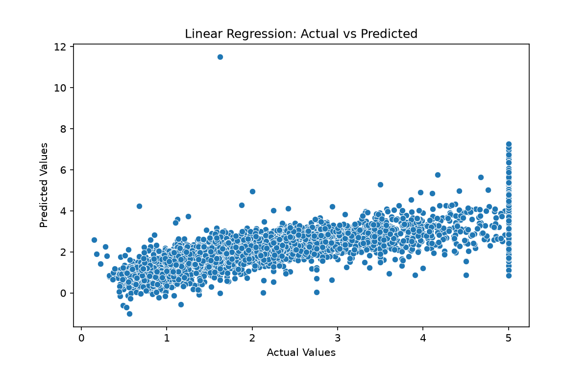

# Lab 04 Report — Introduction to Scikit-learn and Traditional Machine Learning

**Course:** Introduction to Artificial Intelligence (AI–101L)
**Environment:** Python (conda env `ai-lab`), scikit-learn, pandas, matplotlib, seaborn, joblib, TextBlob

---

## Task 4.2–4.4 — Datasets, splits, and baseline models

| Dataset | Task | Shape | Train/test split |
|---|---|---|---|
| California Housing | Regression | 20,640 × 9 | 16,512 train / 4,128 test (80/20, `random_state=42`) |
| Iris | Classification | 150 × 5 | 112 train / 38 test (75/25, `random_state=42`) |

**Linear Regression (housing):** R² = **0.5758**
**Logistic Regression (iris):** Accuracy = **1.0** — perfect classification on all three species, with a fully diagonal confusion matrix (see Exercise 3).

## Task 4.5 — Pipeline and standardisation

A `Pipeline([('scaler', StandardScaler()), ('model', LinearRegression())])` was fitted on the same training data.

**Pipeline R²: 0.5758** — identical (to floating-point precision, difference ≈ 6.6e-16) to the plain model. See Exercise 1 for why.

## Task 4.6 — Model persistence

`reg_model` was saved with `joblib.dump('linear_model.pkl')` and reloaded in the same session. The reloaded model's R² matched exactly (0.5758), confirming the persisted artefact reproduces predictions identically.

## Task 4.7 — Diagnostic scatter plot



Reading the plot as a diagnostic: there is a visible **horizontal ceiling** of points near actual value 5.0 (California housing target values are capped at 5.0, so the model cannot predict above what it was never trained to see beyond), and the **spread widens** toward higher actual values, meaning prediction error grows with the target. Both patterns match the instructor's framing exactly, and together they suggest the linear model under-predicts high-value homes and that a log-transformed target or a non-linear model might fit this relationship better.

---

## In-Lab Exercises

**Exercise 1 — plain vs pipeline R², and standardisation's effect on OLS**

Plain `LinearRegression` R² = 0.5758; Pipeline R² = 0.5758 (same, to floating-point precision). Standardisation is a linear rescaling of each feature. Ordinary least squares finds the best-fitting hyperplane by minimising squared error, and the optimal hyperplane's *predictions* are unchanged by rescaling features — only the fitted coefficients change (they rescale to compensate), so the model's R² is identical either way.

This would **not** hold for model families whose results depend directly on feature scale: **k-Nearest Neighbors** (distance calculations are dominated by whichever feature has the largest raw range), **Support Vector Machines** (margins are distance-based), and **Ridge/Lasso regression** (the regularisation penalty sums squared or absolute coefficients, so unscaled features receive unfairly small or large penalties). For these, standardisation changes the actual model output.

**Exercise 2 — regression coefficients and feature scale**

| Feature | Coefficient |
|---|---|
| AveBedrms | 0.7831 |
| MedInc | 0.4487 |
| Longitude | −0.4337 |
| Latitude | −0.4198 |
| AveRooms | −0.1233 |
| HouseAge | 0.0097 |
| AveOccup | −0.0035 |
| Population | −0.000002 |

The two largest absolute coefficients are `AveBedrms` (0.783) and `MedInc` (0.449). Notably, `AveBedrms` outranks `MedInc` despite median income being the more intuitively dominant driver of housing value — this is exactly the scaling artefact the exercise points to. `AveBedrms` has a narrow natural range in this data (roughly 0.8–1.3), so even a modest real effect on house value produces a large coefficient, while `MedInc` spans roughly 0–15, spreading its influence across a correspondingly smaller coefficient per unit. Raw coefficients therefore cannot be compared across features until those features are put on the same scale (standardised to mean 0, standard deviation 1); only then do coefficient magnitudes reflect relative importance rather than measurement units.

**Exercise 3 — reading the iris confusion matrix**

|  | pred_setosa | pred_versicolor | pred_virginica |
|---|---|---|---|
| **true_setosa** | 15 | 0 | 0 |
| **true_versicolor** | 0 | 11 | 0 |
| **true_virginica** | 0 | 0 | 12 |

The matrix is perfectly diagonal — zero confusions between any pair of species, matching the 1.0 accuracy and 1.00 recall for all three classes in the classification report. Iris is a well-known, cleanly separated dataset (setosa in particular is linearly separable from the other two species on petal measurements alone), so a perfect score here reflects the dataset's separability rather than an unusually strong model. On a harder or more realistic dataset, versicolor and virginica — which overlap more in feature space than either does with setosa — would be the pair most likely to show confusion.

**Exercise 4 — swapping LogisticRegression for DecisionTreeClassifier**

| Model | Accuracy |
|---|---|
| LogisticRegression | 1.0 |
| DecisionTreeClassifier (`random_state=42`) | 1.0 |

Swapping the estimator required changing only the constructor call; the identical `.fit()`, `.predict()`, `accuracy_score`, `confusion_matrix`, and `classification_report` calls worked unchanged. This demonstrates the practical value of Scikit-learn's consistent estimator interface: because every classifier exposes the same `.fit()`/`.predict()` methods and every metric function accepts predictions from any estimator, comparing fundamentally different model families (linear vs tree-based) is a one-line edit with zero changes to the surrounding evaluation or reporting code.

---

## Home Assignment — Sentiment classification pipeline on the Lab 2 corpus

**Data.** The 15-article two-source corpus from Lab 02 (`two_source_corpus.csv`) was reused. Sentiment polarity was recomputed with TextBlob, and each article was labelled `1` (above the corpus median polarity, 0.1703) or `0` (at or below). The label split was 8 below-median and 7 above-median.

**Pipeline.** `Pipeline([('tfidf', TfidfVectorizer()), ('clf', LogisticRegression(max_iter=1000))])`, trained on a 70/30 stratified split (`random_state=42`), giving 10 training and 5 test articles.

**Results on the 5-article test set:**

| Metric | Value |
|---|---|
| Accuracy | 0.80 |

|  | pred 0 | pred 1 |
|---|---|---|
| **true 0** | 2 | 1 |
| **true 1** | 0 | 2 |

| Class | Precision | Recall | F1 |
|---|---|---|---|
| 0 (below median) | 1.00 | 0.67 | 0.80 |
| 1 (above median) | 0.67 | 1.00 | 0.80 |

**Interpretation.** With only 5 articles in the test set, 80% accuracy corresponds to exactly one misclassified article (a true-0 article predicted as 1), so this number should not be read as a reliable estimate of real-world performance — a single flipped prediction would swing the accuracy by 20 percentage points. The pattern (perfect precision but imperfect recall for class 0) is consistent with a model that, on this tiny sample, is slightly biased toward predicting "above median."

**Persistence and demonstration.** The fitted pipeline was saved with `joblib.dump(sentiment_pipeline, "sentiment_pipeline.pkl")`. In a **separate, fresh notebook** (`demo_fresh_notebook.ipynb`), the pipeline was reloaded with `joblib.load` and run directly on a raw, unprocessed string with no manual tokenisation, vectorisation, or cleaning:

```
Raw input: "This new AI tool is absolutely fantastic and makes content creation a breeze."
Predicted label: 1 (above median polarity)
Prediction probabilities [below, above]: [0.4919, 0.5081]
```

The pipeline correctly handled the raw string end-to-end (TF-IDF vectorisation and classification both happen inside the loaded object), confirming it is fully self-contained and requires no external preprocessing code to reuse. The near-even probability split (50.8% vs 49.2%) shows the model's confidence on this example was low, again a reflection of the very small training set (10 articles) rather than a strong learned signal.

---

## Limitations

- The housing R² of 0.576 leaves nearly half the variance in house value unexplained; the diagnostic plot suggests both a clipped target and non-linear structure that a plain linear model cannot capture.
- Iris's perfect accuracy is a property of the dataset's separability, not evidence that either model would generalise this well on a harder classification task.
- The home-assignment sentiment classifier was trained and tested on only 15 articles total (10 train / 5 test). Both the 80% accuracy and the fresh-notebook probability estimate should be treated as illustrative of the pipeline working correctly, not as a reliable measure of real predictive power. A meaningful evaluation would need a much larger, more balanced article corpus.

## Deliverables checklist

- [x] `lab04/Lab 04.ipynb` — executed top to bottom
- [x] `lab04/linear_model.pkl` — persisted regression model
- [x] `lab04/sentiment_pipeline.pkl` — home-assignment pipeline
- [x] `lab04/figures/actual_vs_predicted.png` — diagnostic scatter plot
- [x] `lab04/demo_fresh_notebook.ipynb` — fresh-notebook demonstration on a raw string
- [x] `lab04/report.md` — this file, both metric tables and the coefficient analysis
